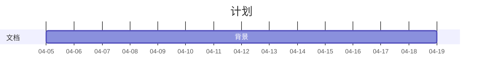

# 基于 hdfs 的分布式可扩展文件管理系统设计与开发

## 项目说明

- [ ] 背景
- [ ] 阶段一
- [ ] 阶段二
- [ ] 阶段三

本课程分为三个阶段：

1.阶段一：利用 docker，以集群（或伪集群）的方式搭建 hdfs 分布式文件系统；

2.阶段二：熟悉利用 python/golang 接口向阶段一搭建的文件系统进行文件上传、下载、查询、删除；

3.阶段三：利用web技术及阶段二成果建立小型网盘，实现文件的可视化上传、下载、查询、删除；

要求：

- 使用技术：hdfs、docker、python/golang、http、前端(python.flask/原 javascript（es6）、html5、css3 暂未确定)等；
- 后端运行环境：X86_X64、Hadoop3.X；
- 管理端运行环境：基于 H5 的 WebApp，仅需支持 PC 分辨率；

其他要求（课程附加）：

- 开发模型选择

成果：

- 工程代码一套
- 操作手册
- 测试用例
- 需求规格说明书
- 建设方案
- 汇报PPT

## 工程师交流 2022.4.5

### 需求

文件增删改查接口

阿里对象存储接口

使用web接上网盘

全部文件都做成二进制

文件上传形式：IO流

### 后端

后端运行环境：Hadoop3.X

docker打包，直接上传到公司服务器

结点数量建议在 3-4 个，每个结点都放在单独的 docker 中

使用 python/golang 做接口

### 前端

实现点击上传就行，上传下载（后期可添加拖拽上传）

不需要文件预览（后期可添加图片预览和视频预览）
